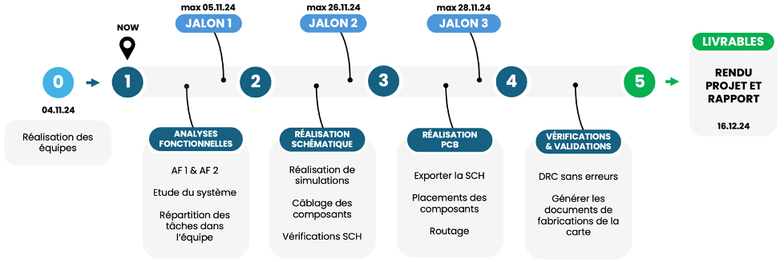
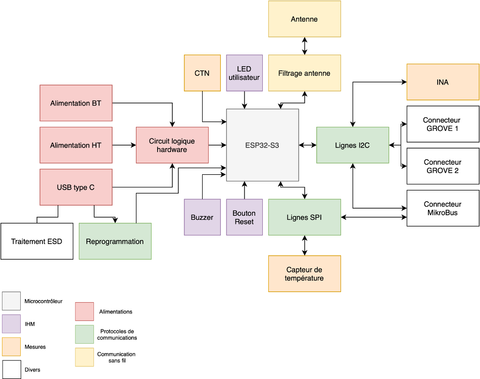

# 📟 Projet Hardware – Carte de Développement YNOV-DevBoard-v1

## 📌 Objectifs

Vous devez concevoir une **carte électronique à base d’ESP32-PICO-D4** répondant aux exigences suivantes :

- **Alimentation multiple** avec priorité :
  - USB-C (5V)
  - Basse Tension (2.7V – 10V)
  - Haute Tension (jusqu’à 36V)
- **Capteurs**  :
   - Courant et tension via INA (communication en I2C)
   - Température via CTN (ADC)
   - Température via TMP126 (communication en SPI)
- **Interface homme-machine** :
  - Buzzer
  - LEDs
  - Boutons **Boot** et **Reset**
- **ICommunication sans fil** :
  - BLE
- **Compatibilité avec MikroBus et Grove**

### Étapes de réalisation

1. Analyse fonctionnelle du système
2. Sélection des composants
3. Réalisation de la schématique
4. Routage du PCB (taille max : **70mm x 50mm**)
5. Fournir :
   - Fichiers DRC sans erreurs
   - Fichiers de fabrication

Un projet Altium est fourni avec :
- Une schématique vide
- Un PCB vide
- Des bibliothèques de symboles et empreintes

---

## 📊 Notation

| Attendus                               | Points |
|----------------------------------------|--------|
| **Schématique**                        |        |
| Réalisation de la schématique          |    7   |
| Câblage correct                        | 5      |
| Lisibilité de la schématique           | 2      |
| **PCB**                                |        |
| Réalisation du PCB                     | 5      |
| Respect des règles de routage/taille   | 2      |
| DRC sans erreur                        | 2      |
| Fichiers de fabrication                | 1      |
| **Rapport**                            |        |
| Analyses fonctionnelles                | 2      |
| Explication des blocs schématiques     | 2      |
| Problèmes rencontrés + solutions       | 2      |
| Suivi projet (jalons)                  | 2      |

⏳ **Deadline : 16 décembre 2024 à 17h00**  
📁 À rendre dans un `.zip` nommé `Equipe_NumeroX_Projet_rendu`, à **push sur GitHub** :  
👉 https://github.com/COURS-YNOV/Projet-YNOV-DevBoard-v1

---

## 📅 Planning recommandé

---

## 🔩 Composants principaux

| Fonction         | Référence            |
|------------------|----------------------|
| Microcontrôleur  | ESP32-PICO-D4        |
| USB-UART         | CP2104-F03-GM        |
| Connecteur USB-C | USB4085-GF-A         |
| Capteur courant  | INA237AIDGST         |
| Divers           | Résistances, Capa, LED, MikroBus, Grove, Antenne, boutons Boot/Reset, etc. |

---

## 🧩 Rappel schéma fonctionnel

---

## 📐 Règles de conception imposées

### Général

- Schéma en **mils**
- PCB en **mm**
- Titre, révision et nom du dessinateur sur la schématique

### Schématique

- Les **paires différentielles** doivent apparaître

### Routage

- ❌ **Pas d’angles droits**
- ✅ Connexions au **centre des pads**
- ✅ Éviter les angles aigus/soudures complexes
- ✅ Plan de masse **obligatoire**
- ❌ Aucun composant sur la face **Bottom**
- **Vias** :
  - Pad : 0.85 mm
  - Trou : 0.35 mm
- **Sérigraphie** : largeur min. 0.15 mm
- **Impédance ligne de reprogrammation** : 50 Ohms
- **Plan masse/puissance** adapté à l'antenne BLE
- Vias d’assemblage selon besoins (Top layer)

---

## 🔗 Liens utiles

| Description                 | Lien     |
|-----------------------------|----------|
| Raccourcis Altium           | [click](https://www.altium.com/documentation/altium-designer/shortcut-keys#shortcut-listings) |
| Guide de routage            | [click](https://www.rowsum.com/fr/31-conseils-de-routage-des-circuits-imprimes/) |
| Calculateur de résistance   | [click](https://www.digikey.fr/en/resources/conversion-calculators/conversion-calculator-led-series-resistor) |

---

## 💬 Remarque

Ce projet est **en groupe**, mais la **notation est individuelle**.  
